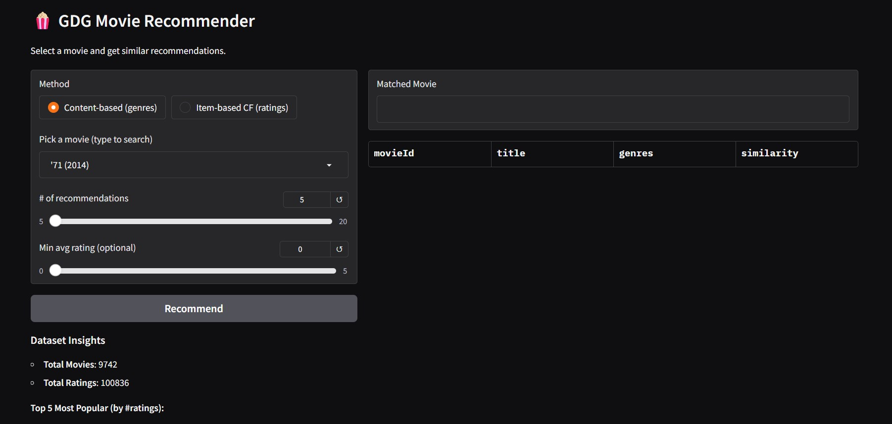
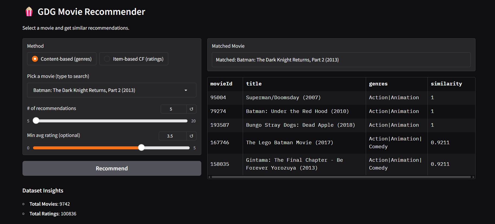
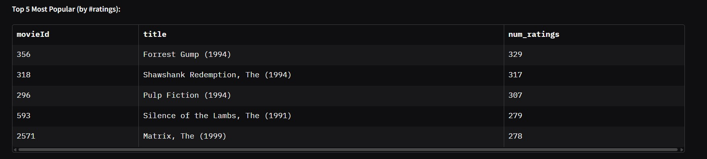
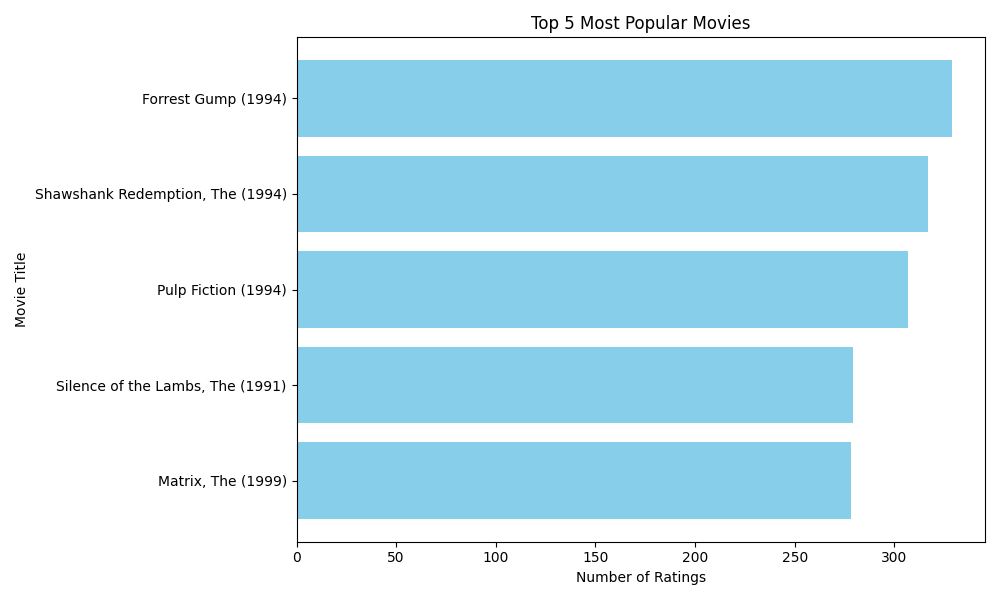

# 🎬 Movie Recommender System

A simple and interactive **Movie Recommendation System** built using the **MovieLens Small Dataset** and a **Gradio Web UI**.  
Users can enter a movie name and get **5-20 similar movie recommendations** instantly!

---

## 🚀 Features
✅ Clean & simple **Gradio UI**  
✅ **Content-based recommendation** using genres  
✅ Movie insights: total movies, total ratings, popular movies  
✅ Beginner-friendly setup (no complex backend)  

---

## 🗂 Folder Structure
┣ 📂 data # Dataset files (movies.csv, ratings.csv, links.csv, tags.csv)

┣ 📂 artifacts # (Optional) For storing any model artifacts in the future

┣ 📜 recommender.py # Core recommendation logic

┣ 📜 gradio_app.py # Main app file to run UI

┣ 📜 explore.py # Dataset exploration & insights

┣ 📜 requirements.txt # Dependencies

┗ 📜 README.md # Project documentation


---

## 📊 Dataset
We use the **MovieLens Small Dataset**:  
- ~9,700 movies  
- ~100,000 ratings from ~600 users  

Dataset source: [MovieLens Small Dataset](https://grouplens.org/datasets/movielens/latest/)  

---

## 🔍 Quick Insights (from `explore.py`)
| Metric                  | Value    |
|------------------------|---------|
| Total Movies           | 9,742   |
| Total Ratings          | 100,836 |
| Top Movie (by ratings) | *Forrest Gump (1994)* - 329 ratings |

---

## 🛠️ Installation

1. **Clone the repository**
   ```bash
   git clone https://github.com/Nova-cmd-oss/gdg-movielens-recommender.git
   
   cd movie-recommender

2. Create virtual environment (optional but recommended)
   python -m venv venv
   source venv/bin/activate      # Mac/Linux
   venv\Scripts\activate         # Windows

3. Install dependencies
   pip install -r requirements.txt

▶️ Running the App

Run this command to launch the app:
   python gradio_app.py
Running on local URL: http://127.0.0.1:7860

---

## 📸 Screenshots

| Home Page                | Example Search: The Dark Knight            |
|--------------------------|-------------------------------------------|
|  |  |

| Data Insights            |
|--------------------------|
|  |  |

---

🧠 How It Works

We use content-based filtering:

- Movies are recommended based on genre similarity.
- Cosine similarity is used to find closest matches.
- Add ratings filter to show highly-rated movies only.

---

👨‍💻 Author

## krishna Agarwal

Member applicant for GDG On Campus


